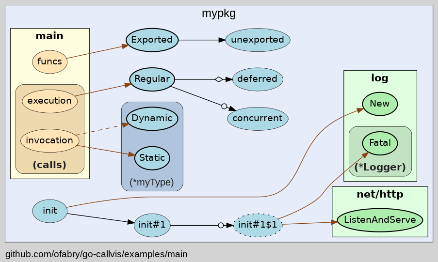

<p align="center"></p>

<h1 align="center">go-callvis</h1>

<p align="center">
  <a href="https://github.com/TrueFurby/go-callvis/releases"></a>
  <a href="https://travis-ci.org/TrueFurby/go-callvis"></a>
  <a href="https://gophers.slack.com/archives/go-callvis"></a>
</p>

<p align="center"><b>go-callvis</b> is a development tool to help visualize call graph of a Go program using interactive view.</p>

---

## Introduction

The purpose of this tool is to provide developers with a visual overview of a Go program using data from call graph 
and its relations with packages and types. This is especially useful in larger projects where the complexity of 
the code much higher or when you are just simply trying to understand code of somebody else.

### Features

- focus specific package in the program
- group functions by package and/or methods by type
- filter packages to specific import path prefixes
- omit various types of function calls
- :boom: **NEW!** interactive view using HTTP server that serves SVG images 
  containing URLs on packages to change focused package dynamically

### Output preview

[](https://raw.githubusercontent.com/TrueFurby/go-callvis/master/images/main.png)

> Check out the [source code](examples/main) for the above image.

### How it works

It runs [pointer analysis](https://godoc.org/golang.org/x/tools/go/pointer) to construct the call graph of the program and 
uses the data to generate output in [dot format](http://www.graphviz.org/content/dot-language), which can be rendered with Graphviz tools.

## Reference guide

Here you can find descriptions for various types of output.

### Packages / Types

|Represents  | Style|
|----------: | :-------------|
|`focused`   | **blue** color|
|`stdlib`    | **green** color|
|`other`     | **yellow** color|

### Functions / Methods

|Represents   | Style|
|-----------: | :--------------|
|`exported`   | **bold** border|
|`unexported` | **normal** border|
|`anonymous`  | **dotted** border|

### Calls

|Represents   | Style|
|-----------: | :-------------|
|`internal`   | **black** color|
|`external`   | **brown** color|
|`static`     | **solid** line|
|`dynamic`    | **dashed** line|
|`regular`    | **simple** arrow|
|`concurrent` | arrow with **circle**|
|`deferred`   | arrow with **diamond**|

## Quick start

#### Requirements

- [Go](https://golang.org/dl/) 1.8+
- [Graphviz](http://www.graphviz.org/download/)

### Installation

```sh
go get -u github.com/TrueFurby/go-callvis
cd $GOPATH/src/github.com/TrueFurby/go-callvis && make
```

### Usage

`go-callvis [flags] <main package>`

This will start HTTP server listening at [http://localhost:7878/](http://localhost:7878/). You can change it via `-http` flag. 

#### Flags

```
-focus string
      Focus package with import path or name. (default: main)
-group string
    Grouping functions by packages and/or types. [pkg, type] (separated by comma)
-http string
	HTTP service address. (default ":7878")
-limit string
    Limit package paths to prefix. (separated by comma)
-ignore string
    Ignore package paths with prefix. (separated by comma)
-include string
   	Include package paths with given prefixes (separated by comma)
-nointer
	Omit calls to unexported functions.
-nostd
	Omit calls to/from packages in standard library.
-tags build tags
	a list of build tags to consider satisfied during the build.
-tests
	Include test code.
```

Run `go-callvis -h` to list all supported flags.

## Examples

Here is an example for the project [syncthing](https://github.com/syncthing/syncthing).

[](https://raw.githubusercontent.com/TrueFurby/go-callvis/master/images/syncthing.png)

> Check out [more examples](examples) and used command options.

## Community

Join [#go-callvis](https://gophers.slack.com/archives/go-callvis) channel at [gophers.slack.com](http://gophers.slack.com). (*not a member yet?* [get invitation](https://gophersinvite.herokuapp.com))

### How to help

Did you find any bugs or have some suggestions?
- Feel free to open [new issue](https://github.com/TrueFurby/go-callvis/issues/new) or start discussion in the slack channel.

Do you want to contribute to the project?
- Fork the repository and open a pull request. [Here](https://github.com/TrueFurby/go-callvis/projects/1) you can find TODO features.

---

#### Roadmap

##### The *interactive tool* described below has been published as a *separate project* called [goexplorer](https://github.com/TrueFurby/goexplorer)!

> Ideal goal of this project is to make web app that would locally store the call graph data and then provide quick access of the call graphs for any package of your dependency tree. At first it would show an interactive map of overall dependencies between packages and then by selecting particular package it would show the call graph and provide various options to alter the output dynamically.
